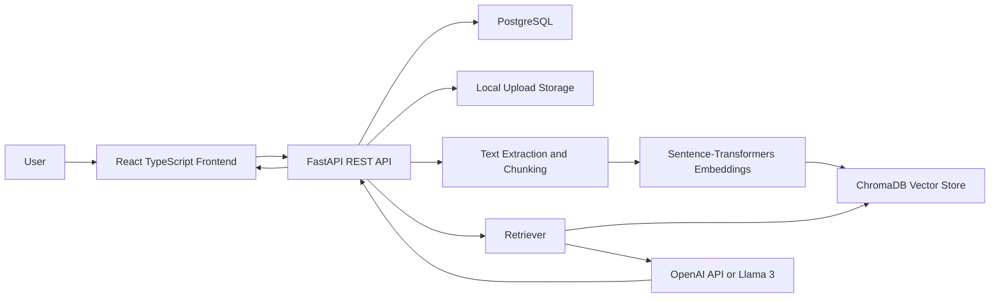

# DocuMind - AI Document Q&A Assistant

DocuMind is a production-style Retrieval-Augmented Generation portfolio project. Users can register, upload PDF/TXT/DOCX documents, index document chunks into ChromaDB, ask grounded questions, review citations, save conversations, and submit answer feedback.

## Features

- JWT authentication with hashed passwords and protected user-specific endpoints
- PDF, TXT, and DOCX upload with file validation, duplicate detection, extraction, chunking, and processing status
- Sentence-Transformers embeddings stored in ChromaDB with user and document metadata
- RAG question-answering through OpenAI by default, with optional Llama 3 via Ollama-compatible chat endpoint
- Prompt-injection protection through strict system prompting and document text treated as untrusted data
- Conversation history, message source citations, answer feedback, document deletion, search, filter, and reprocessing
- React + TypeScript frontend with dashboard, upload, document management, chat, history, and profile pages
- PostgreSQL schema managed by SQLAlchemy and Alembic
- Pytest backend coverage with mocked LLM/vector dependencies
- Docker Compose and GitHub Actions CI

## Architecture



## Technology Stack

Backend: Python, FastAPI, SQLAlchemy, Alembic, PostgreSQL, LangChain dependencies, ChromaDB, Sentence-Transformers, OpenAI, Pytest.

Frontend: React, TypeScript, Vite, React Router, lucide-react.

Operations: Docker, Docker Compose, GitHub Actions.

## Local Setup

1. Create environment file:

```bash
cp .env.example .env
```

2. Start PostgreSQL with Docker:

```bash
docker compose up postgres
```

3. Install backend dependencies:

```bash
cd backend
python -m venv .venv
source .venv/bin/activate
pip install -r requirements.txt
```

4. Run migrations:

```bash
alembic upgrade head
```

5. Start the API:

```bash
uvicorn app.main:app --reload
```

FastAPI documentation is available at [http://localhost:8000/api/docs](http://localhost:8000/api/docs).

6. Start the frontend:

```bash
cd frontend
npm install
npm run dev
```

The frontend runs at [http://localhost:5173](http://localhost:5173).

## Docker

```bash
cp .env.example .env
docker compose up --build
```

Services:

- Frontend: [http://localhost:5173](http://localhost:5173)
- Backend: [http://localhost:8000](http://localhost:8000)
- API docs: [http://localhost:8000/api/docs](http://localhost:8000/api/docs)
- Postgres: `localhost:5432`

## Configuration

Important environment variables:

- `DATABASE_URL`
- `JWT_SECRET`
- `OPENAI_API_KEY`
- `LLM_PROVIDER` (`openai` or `llama`)
- `EMBEDDING_MODEL`
- `CHUNK_SIZE`
- `CHUNK_OVERLAP`
- `RETRIEVAL_TOP_K`
- `MAX_UPLOAD_SIZE_MB`
- `UPLOAD_DIR`
- `CHROMA_DIR`

If `OPENAI_API_KEY` is not set, the backend uses a deterministic extractive fallback so the app can still be demonstrated locally.

## Testing

Backend tests mock external LLM and vector calls:

```bash
cd backend
pytest
```

Frontend build check:

```bash
cd frontend
npm run build
```

## Evaluation

The evaluation module runs a small sample set and reports metrics from actual outputs:

```bash
cd backend
python -m evaluation.evaluate
```

It measures correct document retrieval, source attribution presence, unsupported-answer rate, and response time. Use these generated values if presenting performance metrics.

## Sample Documents

Harmless demo files are included in `backend/sample_documents`:

- Employee handbook
- Product user guide
- University policy
- Healthcare portal FAQ

## API Endpoints

- `POST /api/auth/register`
- `POST /api/auth/login`
- `GET /api/auth/me`
- `POST /api/documents/upload`
- `GET /api/documents`
- `GET /api/documents/{document_id}`
- `DELETE /api/documents/{document_id}`
- `POST /api/documents/{document_id}/reprocess`
- `POST /api/chat/conversations`
- `GET /api/chat/conversations`
- `GET /api/chat/conversations/{conversation_id}`
- `PATCH /api/chat/conversations/{conversation_id}`
- `DELETE /api/chat/conversations/{conversation_id}`
- `POST /api/chat/ask`
- `POST /api/feedback`

## Screenshots

Add screenshots here after running the app locally:

- Dashboard
- Upload flow
- Document detail
- Chat with citations
- Chat history

## Known Limitations

- Uploads are local filesystem based for development.
- Document processing is synchronous to keep local setup simple.
- The fallback answer mode is extractive and intended for offline demos only.
- Basic in-memory rate limiting resets when the API process restarts.

## Future Improvements

- Background workers for large document processing
- Cloud object storage adapter
- Streaming model responses
- Organization/team workspaces
- Admin analytics for feedback and retrieval quality
