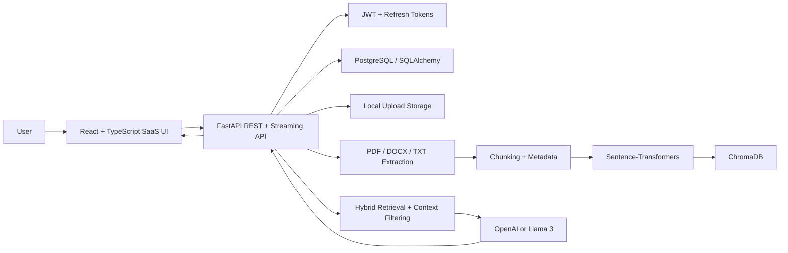

# DocuMind - AI Document Q&A Assistant

DocuMind is a portfolio-grade AI SaaS application for private document question answering. Users upload PDF, TXT, and DOCX files, DocuMind extracts and chunks the content, stores embeddings in ChromaDB, and answers questions only from the uploaded material with citations.

## Architecture



## Main Features

- Registration, login, protected routes, JWT access tokens, refresh tokens, logout, and forgot-password placeholder
- User-specific document access and chat history isolation
- PDF, TXT, and DOCX uploads with extension, MIME, size, empty-file, duplicate, and extraction validation
- Document metadata: size, pages, chunk count, processing status, embedding status, upload date, processed date
- Local file storage for development with a service boundary that can be replaced by cloud storage
- Sentence-Transformers embeddings and persistent ChromaDB vector storage
- Hybrid retrieval scoring using vector relevance plus keyword overlap
- Prompt-injection-resistant RAG prompt that treats documents as untrusted data
- Exact unsupported-answer behavior: `I could not find this information in the uploaded documents.`
- Chat conversations, message history, source citations, confidence score, highlighted excerpts, feedback
- Streaming chat endpoint and ChatGPT-style frontend with markdown rendering, copy, regenerate, rename, and delete
- Modern responsive SaaS dashboard with light/dark mode, toasts, loading skeletons, empty states, and polished navigation
- Detailed health endpoint reporting database, Chroma, OpenAI configuration, and disk usage
- Alembic migrations, Pytest backend tests, Vitest frontend tests, Dockerfiles, Docker Compose, and GitHub Actions

## Tech Stack

Backend:
- Python, FastAPI, Pydantic, SQLAlchemy, Alembic
- PostgreSQL for application data
- ChromaDB for vector persistence
- Sentence-Transformers for embeddings
- OpenAI API by default, optional Llama 3 via Ollama-compatible chat API
- Pytest for backend tests

Frontend:
- React, TypeScript, Vite
- React Router
- react-markdown + remark-gfm
- lucide-react
- Vitest + Testing Library

Operations:
- Docker, Docker Compose
- GitHub Actions CI

## Local Installation

Create an environment file:

```bash
cp .env.example .env
```

Install and run the backend:

```bash
cd backend
python -m venv .venv
source .venv/bin/activate
pip install -r requirements.txt
alembic upgrade head
uvicorn app.main:app --reload
```

Install and run the frontend:

```bash
cd frontend
npm install
npm run dev
```

Local URLs:
- Frontend: [http://localhost:5173](http://localhost:5173)
- Backend: [http://localhost:8000](http://localhost:8000)
- Swagger / OpenAPI: [http://localhost:8000/api/docs](http://localhost:8000/api/docs)
- Health: [http://localhost:8000/api/health](http://localhost:8000/api/health)

## Environment Variables

See `.env.example` for the full list.

Important values:

- `DATABASE_URL`
- `JWT_SECRET`
- `OPENAI_API_KEY`
- `LLM_PROVIDER` (`openai` or `llama`)
- `OPENAI_MODEL`
- `LLAMA_BASE_URL`
- `LLAMA_MODEL`
- `EMBEDDING_MODEL`
- `CHUNK_SIZE`
- `CHUNK_OVERLAP`
- `RETRIEVAL_TOP_K`
- `MIN_RELEVANCE_SCORE`
- `MAX_UPLOAD_SIZE_MB`
- `UPLOAD_DIR`
- `CHROMA_DIR`

If `OPENAI_API_KEY` is empty, DocuMind uses a deterministic extractive fallback for local demos. Production deployments should configure a real LLM provider.

## Database Migrations

```bash
cd backend
alembic upgrade head
```

Current migrations:
- `0001_initial`: users, documents, conversations, messages, sources, feedback
- `0002_refresh_document_metadata`: refresh tokens, page count, embedding status, processed timestamp

## Docker

```bash
cp .env.example .env
docker compose up --build
```

Services:
- `frontend`: React app served by Nginx
- `backend`: FastAPI app
- `postgres`: PostgreSQL database
- `chroma`: ChromaDB service with persistent volume

The backend currently uses embedded Chroma persistence through `CHROMA_DIR`; the Chroma service is included for deployment evolution and operational parity.

## Testing

Backend:

```bash
cd backend
pytest
```

Frontend:

```bash
cd frontend
npm run lint
npm test
npm run build
```

External LLM and vector calls are mocked in backend tests so the suite runs without API credits.

## Evaluation

Run the sample evaluation:

```bash
cd backend
python -m evaluation.evaluate
```

The generated report is stored at `backend/evaluation/evaluation_report.json`. Only use metrics from this actual report; do not invent performance claims.

## Sample Documents

Demo documents are included under `backend/sample_documents`:
- Employee handbook
- Product user guide
- University policy
- Healthcare portal FAQ

## API Highlights

Auth:
- `POST /api/auth/register`
- `POST /api/auth/login`
- `POST /api/auth/refresh`
- `POST /api/auth/logout`
- `POST /api/auth/forgot-password`
- `GET /api/auth/me`

Documents:
- `POST /api/documents/upload`
- `GET /api/documents`
- `GET /api/documents/{document_id}`
- `GET /api/documents/{document_id}/download`
- `GET /api/documents/{document_id}/search`
- `POST /api/documents/{document_id}/reprocess`
- `DELETE /api/documents/{document_id}`

Chat:
- `POST /api/chat/conversations`
- `GET /api/chat/conversations`
- `GET /api/chat/conversations/{conversation_id}`
- `PATCH /api/chat/conversations/{conversation_id}`
- `DELETE /api/chat/conversations/{conversation_id}`
- `POST /api/chat/ask`
- `POST /api/chat/ask/stream`

Feedback:
- `POST /api/feedback`

Dashboard:
- `GET /api/dashboard/summary`

## Screenshots

Add screenshots after running locally:
- Dashboard
- Upload progress
- Document detail and search
- Chat with citations
- Dark mode

## Known Limitations

- Document processing is still synchronous inside the API process; a production system should move this to a background worker.
- The streaming endpoint streams the final generated text to the UI after retrieval and model completion; direct provider token streaming can be added next.
- Local filesystem storage is used for development.
- In-memory rate limiting resets on process restart.
- Docker could not be executed in the current development environment, so image builds should be verified on a machine with Docker installed.

## Roadmap

- Background worker queue for document processing
- Direct provider token streaming
- Cloud object storage adapter
- Organization/team workspaces
- Admin analytics for retrieval quality and feedback
- Stronger observability with traces and metrics
