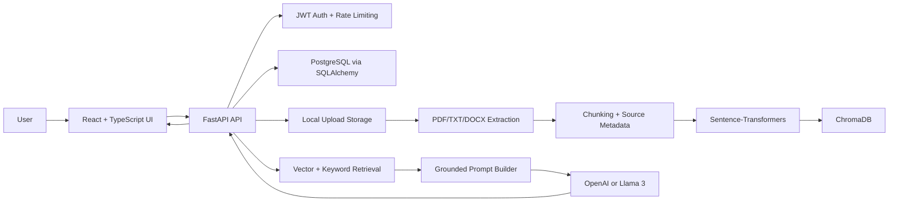
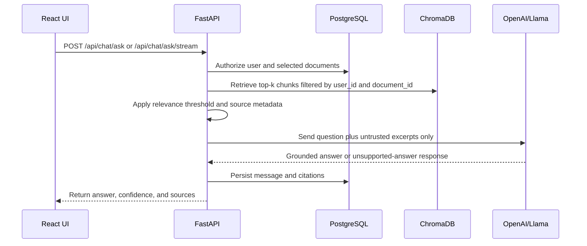
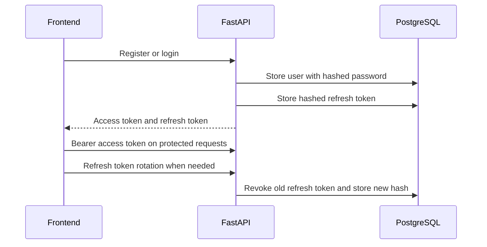

# DocuMind - AI Document Q&A Assistant

DocuMind is a production-style portfolio project for document-grounded question answering. Users can register, upload PDF/TXT/DOCX documents, ask questions over one or more documents, and receive answers constrained to the uploaded content with source citations.

## Business Problem

Teams often store important policies, product guides, support articles, and operating procedures across static documents. Generic chatbots can answer confidently from outside knowledge, which creates trust and compliance problems. DocuMind demonstrates a safer Retrieval-Augmented Generation pattern: retrieve relevant document sections, send only those sections to the model, and return citations so a user can verify the answer.

Example use cases:

- HR handbook and benefits Q&A
- Product support guide search
- University policy assistance
- Healthcare portal FAQ assistance
- Internal onboarding or runbook assistant

## Feature Summary

- User registration, login, JWT access tokens, refresh tokens, logout, and profile endpoint
- Password hashing and basic password strength validation
- User-specific document, vector, chat, and feedback isolation
- PDF, TXT, and DOCX upload with extension, MIME, size, duplicate, empty-file, and extraction validation
- Background document processing with `uploaded`, `processing`, `ready`, and `failed` statuses
- Text extraction, cleanup, chunking, page/chunk metadata, Sentence-Transformers embeddings, and ChromaDB persistence
- RAG answering through OpenAI by default, optional Llama 3 compatible endpoint, and local extractive fallback for demos/tests
- Prompt-injection-resistant prompt that treats uploaded text as untrusted reference data
- Source citations with document name, page number when available, chunk number, excerpt, relevance score, and highlighted excerpt
- Conversations, chat history, rename/delete actions, streaming chat endpoint, and answer feedback
- Document list, search, preview, authenticated download, reprocess, delete, status filters, and dashboard statistics
- Responsive React + TypeScript frontend with light/dark theme, toasts, loading states, and error states
- Alembic migrations, Pytest backend tests, Vitest frontend tests, Dockerfiles, Docker Compose, Render/Railway/Vercel config, and GitHub Actions

## Tech Stack

Backend:

- Python, FastAPI, Pydantic
- SQLAlchemy, Alembic, PostgreSQL
- ChromaDB
- Sentence-Transformers
- LangChain dependency support
- OpenAI API or Llama 3 compatible API
- Pytest

Frontend:

- React, TypeScript, Vite
- React Router
- React Markdown and remark-gfm
- Lucide icons
- Vitest and Testing Library

Operations:

- Docker and Docker Compose
- Render, Railway, Vercel configuration
- GitHub Actions CI

## Architecture



## RAG Flow



Unsupported answer text is standardized:

```text
I could not find this information in the uploaded documents.
```

## Authentication Flow



JWTs are stored in `localStorage` in this portfolio implementation for simple local and static-host demos. A hardened production version should use secure, HTTP-only cookies with CSRF protection.

## Repository Structure

```text
documind-ai-document-qa-assistant/
├── backend/
│   ├── app/
│   │   ├── api/
│   │   ├── core/
│   │   ├── models/
│   │   ├── schemas/
│   │   ├── services/
│   │   └── utils/
│   ├── alembic/
│   ├── evaluation/
│   ├── sample_documents/
│   └── tests/
├── frontend/
│   └── src/
├── .github/workflows/
├── docker-compose.yml
├── render.yaml
├── .env.example
├── .gitignore
└── README.md
```

## Local Installation

Create the environment file:

```bash
cp .env.example .env
```

Backend:

```bash
cd backend
python -m venv .venv
source .venv/bin/activate
pip install -r requirements.txt
alembic upgrade head
uvicorn app.main:app --reload
```

Frontend:

```bash
cd frontend
npm install
npm run dev
```

Local URLs:

- Frontend: [http://localhost:5173](http://localhost:5173)
- Backend health: [http://localhost:8000/api/health](http://localhost:8000/api/health)
- Swagger/OpenAPI: [http://localhost:8000/api/docs](http://localhost:8000/api/docs)

## Environment Variables

| Variable | Purpose |
| --- | --- |
| `DATABASE_URL` | PostgreSQL or local SQLite URL |
| `JWT_SECRET` | Secret used to sign JWT access tokens |
| `REFRESH_TOKEN_EXPIRE_DAYS` | Refresh token lifetime |
| `OPENAI_API_KEY` | OpenAI key for generated answers |
| `LLM_PROVIDER` | `openai` or `llama` |
| `OPENAI_MODEL` | OpenAI chat model |
| `LLAMA_BASE_URL` | Llama/Ollama-compatible API base URL |
| `LLAMA_MODEL` | Llama model name |
| `EMBEDDING_MODEL` | Sentence-Transformers model, or `hashing` for offline smoke tests |
| `CHUNK_SIZE` | Chunk size for document splitting |
| `CHUNK_OVERLAP` | Chunk overlap for document splitting |
| `RETRIEVAL_TOP_K` | Number of chunks retrieved per question |
| `MIN_RELEVANCE_SCORE` | Minimum hybrid relevance score |
| `AUTH_RATE_LIMIT_PER_MINUTE` | Per-client limit for auth endpoints |
| `CHAT_RATE_LIMIT_PER_MINUTE` | Per-client limit for chat endpoints |
| `LLM_TIMEOUT_SECONDS` | LLM request timeout |
| `MAX_UPLOAD_SIZE_MB` | Upload size limit |
| `UPLOAD_DIR` | File storage directory |
| `CHROMA_DIR` | Chroma persistence directory |
| `CORS_ORIGINS` | Allowed frontend origins |
| `VITE_API_URL` | Frontend build-time API URL |

Never commit `.env`, real API keys, database credentials, or JWT secrets.

## Database Migrations

```bash
cd backend
alembic upgrade head
```

Current migrations:

- `0001_initial`: users, documents, conversations, messages, sources, feedback
- `0002_refresh_document_metadata`: refresh tokens, page count, embedding status, processed timestamp
- `0003_ready_document_status`: normalizes legacy `processed` status rows to `ready`

## Docker

```bash
cp .env.example .env
docker compose up --build
```

Services:

- `backend`: FastAPI API
- `frontend`: React app served through Nginx with SPA route fallback
- `postgres`: PostgreSQL
- `chroma`: Chroma service included for operational parity; the backend currently uses embedded persistent Chroma through `CHROMA_DIR`

## Deployment

Frontend options:

- Vercel using `frontend/vercel.json`
- Render static site using the frontend service in `render.yaml`

Backend options:

- Render Docker web service using `render.yaml`
- Railway Docker service using `backend/railway.json`

Production checklist:

- Set `ENVIRONMENT=production`
- Set a strong `JWT_SECRET`
- Set `DATABASE_URL` to managed PostgreSQL
- Set `OPENAI_API_KEY` or configure `LLM_PROVIDER=llama` with a reachable Llama endpoint
- Set `CORS_ORIGINS` to deployed frontend origins only
- Set frontend `VITE_API_URL` to the deployed backend `/api` base URL
- Configure persistent storage for `UPLOAD_DIR` and `CHROMA_DIR`
- Keep `CORS_ORIGINS` free of localhost values when `ENVIRONMENT=production`
- Run `alembic upgrade head` before backend startup
- Verify `/api/health`

## Testing

Backend:

```bash
cd backend
pytest
```

Frontend:

```bash
cd frontend
npm run lint
npm test
npm run build
```

External LLM calls are mocked in tests so the suite can run without API credits.

## Evaluation

Run the sample evaluation:

```bash
cd backend
python -m evaluation.evaluate
```

The report is written to `backend/evaluation/evaluation_report.json`. Use only metrics generated by this script; do not invent performance claims.

## Screenshots

Add portfolio screenshots after running locally:

- Dashboard
- Upload progress
- Document details and preview
- Chat with citations
- Dark mode
- API docs

## Known Limitations

- Background processing uses FastAPI `BackgroundTasks`; production multi-instance deployments should use a durable worker queue.
- Local filesystem storage is used for uploads; production should use object storage before handling real users.
- The streaming endpoint streams the generated answer after retrieval/model completion; direct provider token streaming can be added.
- In-memory rate limiting resets on process restart.
- JWT storage uses `localStorage`; a hardened product should use HTTP-only cookies.

## Future Roadmap

- Durable worker queue with retry/dead-letter handling
- S3-compatible storage adapter
- Direct provider token streaming
- Organization/team workspaces
- Admin analytics for retrieval quality, source coverage, and user feedback
- OpenTelemetry traces and structured production logging
